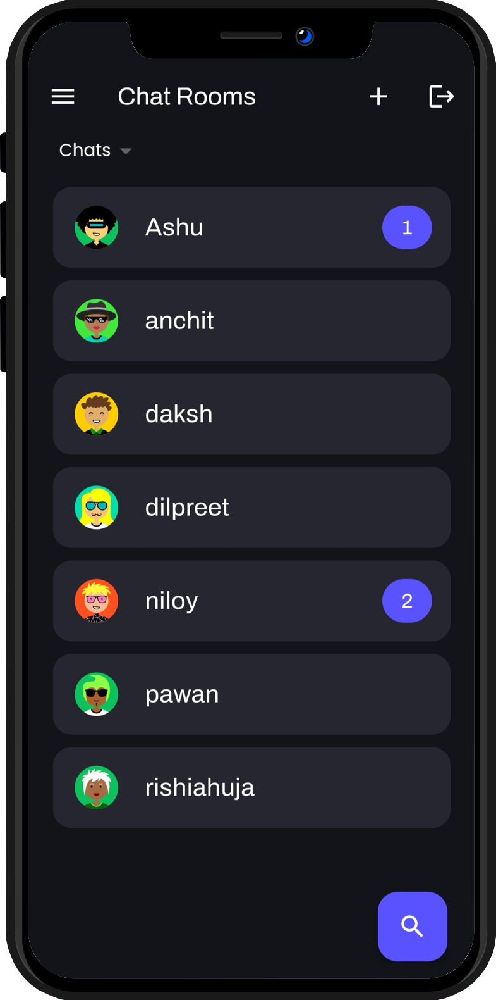
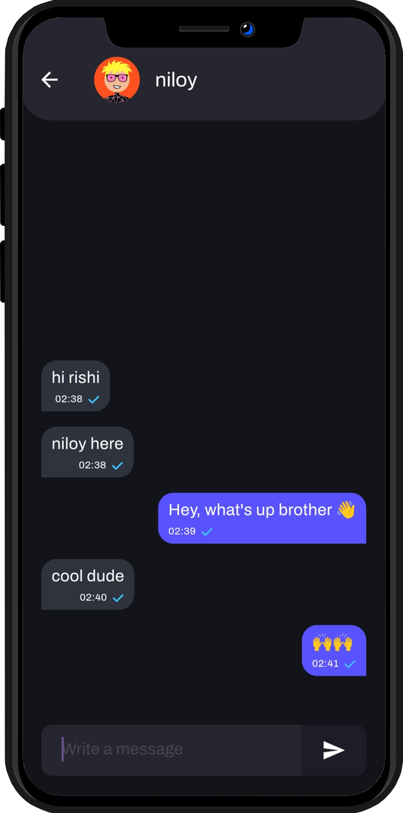
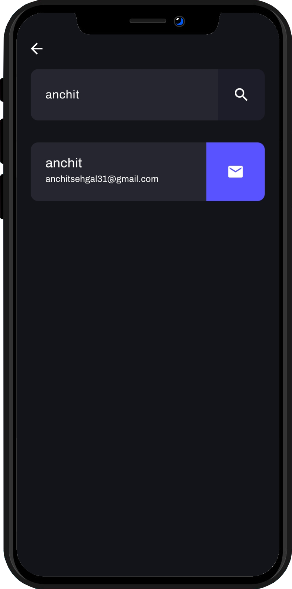
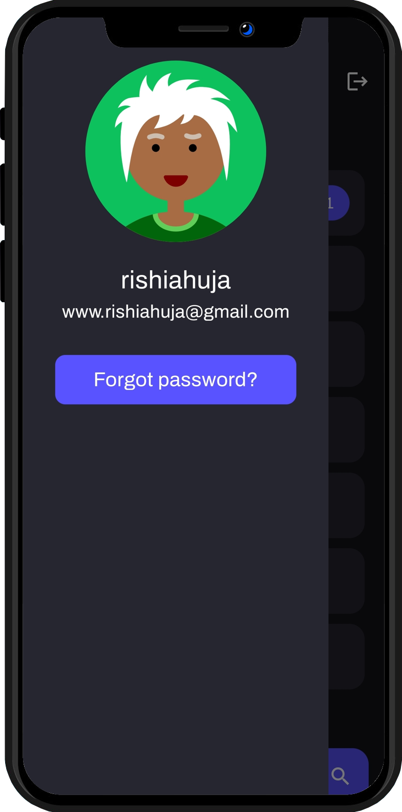
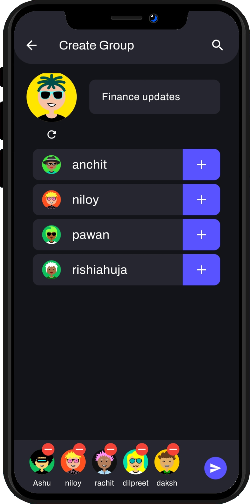
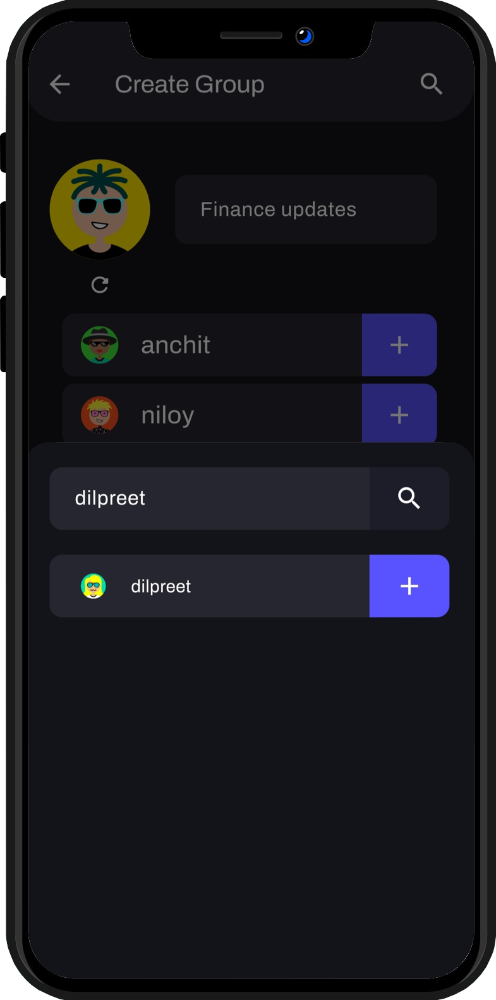
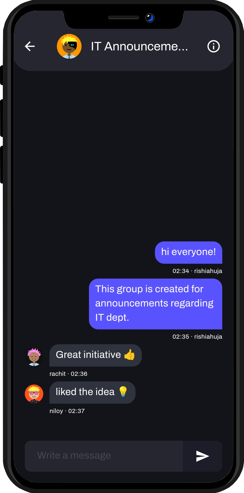

<div align="center">
  <a href="https://raw.githubusercontent.com/RishiAhuja/chat-app/master/assets/readme/icon.png">
    
  </a>

  # Chat App
  
  [](https://flutter.dev/)
  [](https://dart.dev/)
  [](https://firebase.google.com/)
  
  A secure and feature-rich real-time chat application built with Flutter and Firebase
  
  [Download Now](https://github.com/RishiAhuja/chat-app/releases) · [Report Bug](mailto:www.rishiahuja@gmail.com) · [Request Feature](mailto:www.rishiahuja@gmail.com)
</div>

## 📱 About The Project

This fully functional and secure chat application serves as a robust interface between clients and the backend, leveraging Flutter's powerful UI capabilities and Firebase's reliable backend services. The application focuses on providing a seamless messaging experience while maintaining high performance and security standards.

### 🛠️ Core Features

- **Messaging Capabilities**
  - Real-time one-to-one messaging
  - Instant message delivery and updates
  - Custom-designed chat bubbles
  - Seamless communication flow

- **Group Communication**
  - Create and manage group chats
  - Multiple participant support
  - Collaborative group environments
  - Real-time group updates

- **Authentication & Security**
  - Secure email and password authentication
  - Protected user data
  - Encrypted communication
  - Safe user experience

- **Performance Optimization**
  - Implemented pagination for efficient data loading
  - Optimized server load management
  - Streamlined message delivery system

- **Custom UI Elements**
  - Proprietary chat bubble implementation
  - No dependency on pre-built chat libraries
  - Unique and consistent user interface

- **Real-time Architecture**
  - StreamBuilder implementation for live updates
  - Efficient real-time message handling
  - Responsive state management

### 🚀 Future Roadmap

> 💡 **Coming Soon**

- **Cross-Platform Enhancement**
  - Responsive web application support
  - Flutter web compatibility
  - Cross-device synchronization

- **Backend Improvements**
  - Cloud Functions integration
  - Efficient message payload delivery
  - Enhanced backend scalability

- **Advanced Group Features**
  - Enhanced security measures
  - Improved user safety controls
  - Extended group management capabilities

## 📸 Screenshots

<div align="center">
  
  
  
</div>
<div align="center">
  
  
  
</div>
<div align="center">
  
  
</div>

## 🚀 Getting Started

### Prerequisites

- Flutter (Latest Version)
- Firebase Account
- Android Studio/VS Code

### Installation

1. Clone the repository
   ```sh
   git clone https://github.com/RishiAhuja/chat-app.git
   ```
2. Install dependencies
   ```sh
   flutter pub get
   ```
3. Configure Firebase
   - Add your `google-services.json` for Android
   - Add your `GoogleService-Info.plist` for iOS

4. Run the app
   ```sh
   flutter run
   ```

## 🛠️ Built With

- **Frontend Framework**
  - [Flutter](https://flutter.dev) - UI Framework
  - [Dart](https://dart.dev) - Programming Language

- **Backend Services**
  - [Firebase](https://firebase.google.com)
    - Authentication
    - Cloud Firestore
    - Real-time Database
    - Cloud Storage

## 🤝 Contributing

Contributions are what makes the open-source community such an amazing place to learn, inspire, and create. Any contributions you make are **greatly appreciated**.

1. Fork the Project
2. Create your Feature Branch (`git checkout -b feature/AmazingFeature`)
3. Commit your Changes (`git commit -m 'Add some AmazingFeature'`)
4. Push to the Branch (`git push origin feature/AmazingFeature`)
5. Open a Pull Request

## 📬 Contact

Rishi Ahuja - [@RishiAhuja](https://github.com/RishiAhuja) - www.rishiahuja@gmail.com

Project Link: [https://github.com/RishiAhuja/chat-app](https://github.com/RishiAhuja/chat-app)

## 🙏 Acknowledgements

* [Flutter](https://flutter.dev)
* [Firebase](https://firebase.google.com)
* [Flat Icons](https://flaticon.com)
* [Shields.io](https://shields.io)
