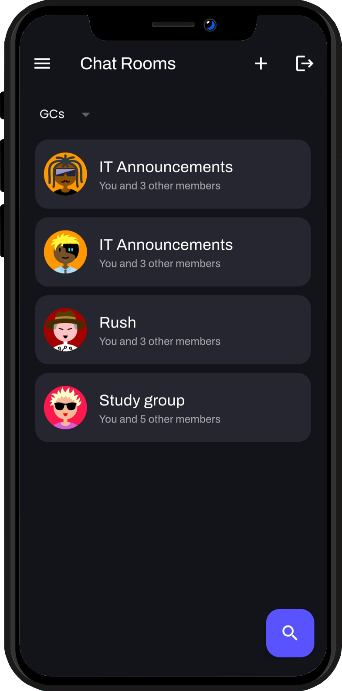

## Chat App

An app for chit-chatting and with friends in groups.

Here are a few resources to get you started, if you want to download the Latest version:

- [Download Here](https://github.com/RishiAhuja/chat-app/releases)
- [Framework: flutter](https://flutter.dev/)

## Screenshots

  
